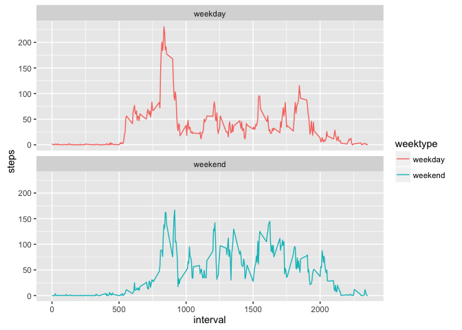

# Reproducible Research: Peer Assessment 1


## Loading and preprocessing the data


```r
setwd("/Users/LucasXin/Documents/R/Raw Data Archive")
activity<-read.csv("activity.csv",header=TRUE,sep=",",na.strings="NA",colClasses=c(date="Date"))
str(activity)
```

```
## 'data.frame':	17568 obs. of  3 variables:
##  $ steps   : int  NA NA NA NA NA NA NA NA NA NA ...
##  $ date    : Date, format: "2012-10-01" "2012-10-01" ...
##  $ interval: int  0 5 10 15 20 25 30 35 40 45 ...
```

```r
head(activity)
```

```
##   steps       date interval
## 1    NA 2012-10-01        0
## 2    NA 2012-10-01        5
## 3    NA 2012-10-01       10
## 4    NA 2012-10-01       15
## 5    NA 2012-10-01       20
## 6    NA 2012-10-01       25
```

It is confirmed that there are 3 variables and 17,568 observations, which was expected. Now that the data has been loaded, we can do the analysis

## What is mean total number of steps taken per day?

First, the total number of steps taken perday is calculated using the dplyr library

```r
library(dplyr)
```

```
## 
## Attaching package: 'dplyr'
```

```
## The following objects are masked from 'package:stats':
## 
##     filter, lag
```

```
## The following objects are masked from 'package:base':
## 
##     intersect, setdiff, setequal, union
```

```r
total_step_day<-activity %>% 
                group_by(date) %>%
                summarize(total.steps=sum(steps, na.rm=FALSE))
head(total_step_day)
```

```
## Source: local data frame [6 x 2]
## 
##         date total.steps
##       (date)       (int)
## 1 2012-10-01          NA
## 2 2012-10-02         126
## 3 2012-10-03       11352
## 4 2012-10-04       12116
## 5 2012-10-05       13294
## 6 2012-10-06       15420
```

Below is the distribution of the total number of stpes taken per day (missing values ignored)

```r
hist(total_step_day$total.steps,
     main="Distribution of steps by Day",
     xlab="Total Number of Steps per Day",
     ylab="Frequency",
     breaks=20, col="Firebrick")
```

<!-- -->

The mean total number of steps taken per day can be calcualted as: 

```r
mean(total_step_day$total.steps,na.rm=TRUE)
```

```
## [1] 10766.19
```

and the median 

```r
median(total_step_day$total.steps,na.rm=TRUE)
```

```
## [1] 10765
```

## What is the average daily activity pattern?

To answer this question, the average number of steps per 5-min internval is compter 

```r
AVG_step<-activity %>%
        group_by(interval) %>%
        summarize(avg.steps=mean(steps,na.rm=TRUE))
head(AVG_step)
```

```
## Source: local data frame [6 x 2]
## 
##   interval avg.steps
##      (int)     (dbl)
## 1        0 1.7169811
## 2        5 0.3396226
## 3       10 0.1320755
## 4       15 0.1509434
## 5       20 0.0754717
## 6       25 2.0943396
```
The figure below shows the average daily activity patteron.

```r
plot(strptime(sprintf("%04d", AVG_step$interval), format="%H%M"),
     AVG_step$avg.steps, type = "l", 
     main = "Average Daily Activity", 
     xlab = "Time of Day (HH:MM)", 
     ylab = "Average Number of Steps")
```

<!-- -->

## Imputing missing values
### Summarize all the missing values

```r
sum(is.na(activity$steps))
```

```
## [1] 2304
```
### Fill missing values with NA

```r
data_full <- activity
nas <- is.na(data_full$steps)
avg_interval <- tapply(data_full$steps, data_full$interval, mean, na.rm=TRUE, simplify=TRUE)
data_full$steps[nas] <- avg_interval[as.character(data_full$interval[nas])]
```
### Check to see if the missing values are patched

```r
sum(is.na(data_full$steps))
```

```
## [1] 0
```
### Calculate the number of steps 

```r
steps_full <- data_full %>%
  filter(!is.na(steps)) %>%
  group_by(date) %>%
  summarize(steps = sum(steps)) %>%
  print
```

```
## Source: local data frame [61 x 2]
## 
##          date    steps
##        (date)    (dbl)
## 1  2012-10-01 10766.19
## 2  2012-10-02   126.00
## 3  2012-10-03 11352.00
## 4  2012-10-04 12116.00
## 5  2012-10-05 13294.00
## 6  2012-10-06 15420.00
## 7  2012-10-07 11015.00
## 8  2012-10-08 10766.19
## 9  2012-10-09 12811.00
## 10 2012-10-10  9900.00
## ..        ...      ...
```

```r
library(ggplot2)
ggplot(steps_full, aes(x = steps)) +
  geom_histogram(fill = "Firebrick", binwidth = 1000) +
  labs(title = "Histogram of Steps per day, including missing values", x = "Steps per day", y = "Frequency")
```

<!-- -->

## Are there differences in activity patterns between weekdays and weekends?
### create a new column with mutate from dplyr,and apply whether the day is weekend or weekday

```r
data_full <- mutate(data_full, weektype = ifelse(weekdays(data_full$date) == "Saturday" | weekdays(data_full$date) == "Sunday", "weekend", "weekday"))
data_full$weektype <- as.factor(data_full$weektype)
head(data_full)
```

```
##       steps       date interval weektype
## 1 1.7169811 2012-10-01        0  weekday
## 2 0.3396226 2012-10-01        5  weekday
## 3 0.1320755 2012-10-01       10  weekday
## 4 0.1509434 2012-10-01       15  weekday
## 5 0.0754717 2012-10-01       20  weekday
## 6 2.0943396 2012-10-01       25  weekday
```
Calculate the average steps in the 5-minute interval and use ggplot for making the time series of the 5-minute interval for weekday and weekend, and compare the average steps

```r
interval_full <- data_full %>%
  group_by(interval, weektype) %>%
  summarise(steps = mean(steps))
s <- ggplot(interval_full, aes(x=interval, y=steps, color = weektype)) +
  geom_line() +
  facet_wrap(~weektype, ncol = 1, nrow=2)
print(s)
```

<!-- -->
